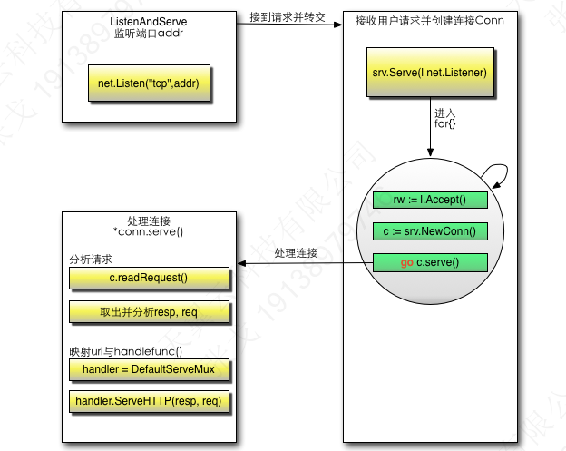

## net/http
http包执行流程

1. 创建Listen Socket, 监听指定的端口, 等待客户端请求到来。
2. Listen Socket接受客户端的请求, 得到Client Socket, 接下来通过Client Socket与客户端通信。
3. 处理客户端的请求, 首先从Client Socket读取HTTP请求的协议头, 如果是POST方法, 还可能要读取客户端提交的数据, 然后交给相应的handler处理请求, handler处理完毕准备好客户端需要的数据, 通过Client Socket写给客户端。

简单的test

```Go
package main
import (
	"fmt"
	"net/http"
	"strings"
	"log"
)
func sayhelloName(w http.ResponseWriter, r *http.Request){
	r.ParseForm()
	fmt.Println(r.Form)
	fmt.Println("path", r.URL.Path)
	fmt.Println("scheme", r.URL.Scheme)
	fmt.Println(r.Form["url_long"])
	for k, v := range r.Form{
		fmt.Println("key:", k)
		fmt.Println("val:", strings.Join(v, ""))

	}
	fmt.Fprintf(w, "Hello gogogo!")

}
func main() {
	http.HandleFunc("/", sayhelloName)
	err := http.ListenAndServe(":9092", nil)
	if err != nil {
		log.Fatal("ListenAndServe: ", err)
	}
```

### 监听端口

通过函数 `ListenAndServe` 来处理，源码如下

```
func ListenAndServe(addr string, handler Handler) error {
	server := &Server{Addr: addr, Handler: handler}
	return server.ListenAndServe()
}
```

其中初始化一个 `server`对象，然后调用`ListenAndServe()`方法

该方法源码

```go
func (srv *Server) ListenAndServe() error {
	if srv.shuttingDown() {
		return ErrServerClosed
	}
	addr := srv.Addr
	if addr == "" {
		addr = ":http"
	}
	ln, err := net.Listen("tcp", addr)
	if err != nil {
		return err
	}
	return srv.Serve(ln)
}

```

其中调用了`net.Listen("tcp", addr)`方法，然后使用`srv.Serve`来监控端口

在`Serve`中，会通过Listener接受请求`l.Accept()`，然后创建一个Conn：`c:=srv.newConn(rw)`，最后单独开了一个goroutine，把这个请求的数据当做参数扔给这个conn去服务：`go c.serve(connCtx)`。

conn首先会解析request:`w, err := c.readRequest(ctx)`, 然后获取相应的handler去处理请求:`serverHandler{c.server}.ServeHTTP(w, w.req)`，`ServeHTTP`的具体实现如下：

```Go
func (sh serverHandler) ServeHTTP(rw ResponseWriter, req *Request) {
	handler := sh.srv.Handler
	if handler == nil {
		handler = DefaultServeMux
	}
	if req.RequestURI == "*" && req.Method == "OPTIONS" {
		handler = globalOptionsHandler{}
	}
	handler.ServeHTTP(rw, req)
}
```

`sh.srv.Handler`就是我们刚才在调用函数`ListenAndServe`时候的第二个参数，我们前面例子传递的是nil，也就是为空，那么默认获取`handler = DefaultServeMux`,这个变量就是一个路由器，它用来匹配url跳转到其相应的handle函数，我们调用的代码里面调用了`http.HandleFunc("/", sayhelloName)`。这个作用就是注册了请求`/`的路由规则，当请求uri为"/"，路由就会转到函数sayhelloName，DefaultServeMux会调用ServeHTTP方法，这个方法内部其实就是调用sayhelloName本身，最后通过写入response的信息反馈到客户端。




### Conn、ServeMux

Go在等待客户端请求里面是这样写的：

```Go
c, err := srv.newConn(rw)
if err != nil {
	continue
}
go c.serve()

```

客户端的每次请求都会创建一个Conn，这个Conn里面保存了该次请求的信息，然后再传递到对应的handler，该handler中便可以读取到相应的header信息

### 表单

`r.Form`对不同类型的表单元素的留空有不同的处理， 对于空文本框、空文本区域以及文件上传，元素的值为空值

通过`r.Form.Get()`来获取值，因为如果字段不存在，通过该方式获取的是空值。但是通过`r.Form.Get()`只能获取单个的值，如果是map的值，必须通过上面的方式来获取。

#### 正则获取需要的内容

中文

```Go
if m, _ := regexp.MatchString("^\\p{Han}+$", r.Form.Get("realname")); !m {
	return false
}
```

#### 下拉菜单

```Go
slice:=[]string{"apple","pear","banana"}

v := r.Form.Get("fruit")
for _, item := range slice {
	if item == v {
		return true
	}
}
return false
```

#### 复选

接收到的数据是slice

```go
slice:=[]string{"football","basketball","tennis"}
a:=Slice_diff(r.Form["interest"],slice)
if a == nil{
	return true
}

return false
```

#### 验证数据

Go的html/template里面带有下面几个函数可以转义

- func HTMLEscape(w io.Writer, b []byte)  //把b进行转义之后写到w
- func HTMLEscapeString(s string) string  //转义s之后返回结果字符串
- func HTMLEscaper(args ...interface{}) string //支持多个参数一起转义，返回结果字符串

如果想在浏览器上看到正常的输出，可以使用text/template或者html/template

```go
import "text/template"
...
t, err := template.New("foo").Parse(`{{define "T"}}Hello, {{.}}!{{end}}`)
err = t.ExecuteTemplate(out, "T", "<script>alert('you have been pwned')</script>")
...
t, err := template.New("foo").Parse(`{{define "T"}}Hello, {{.}}!{{end}}`)
err = t.ExecuteTemplate(out, "T", template.HTML("<script>alert('you have been pwned')</script>"))
```

#### 防止多次提交

通过token（可以是时间戳，随机数等

### 文件上传

